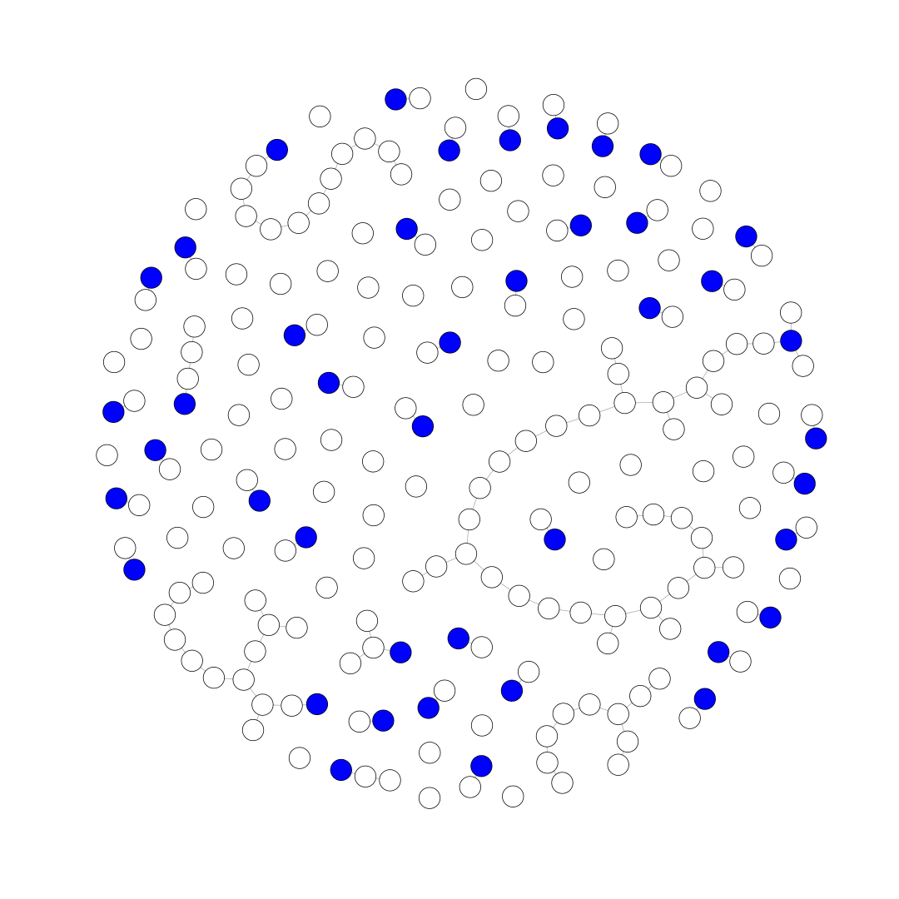
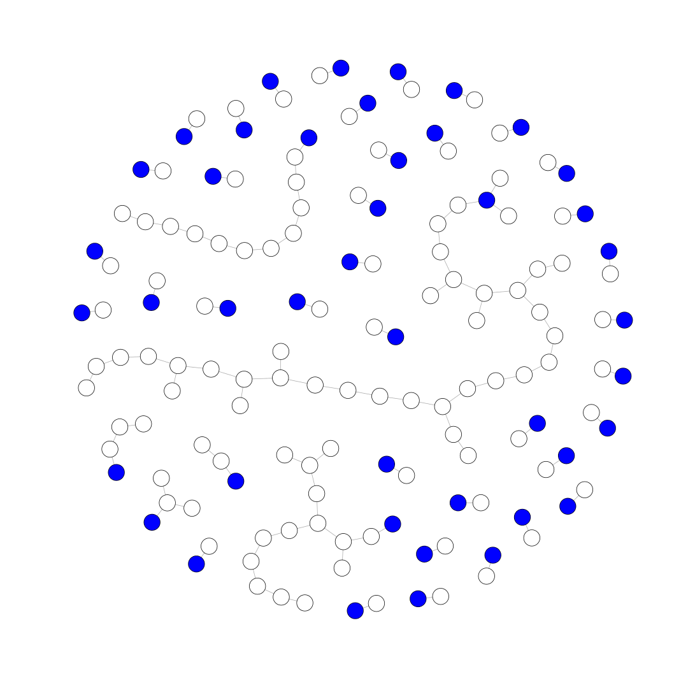
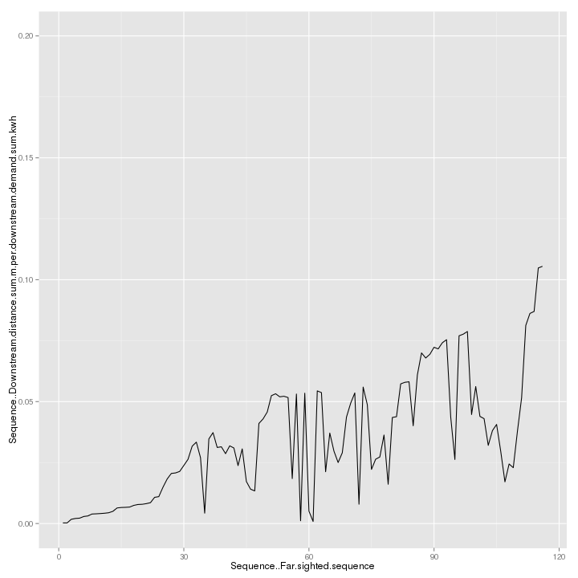
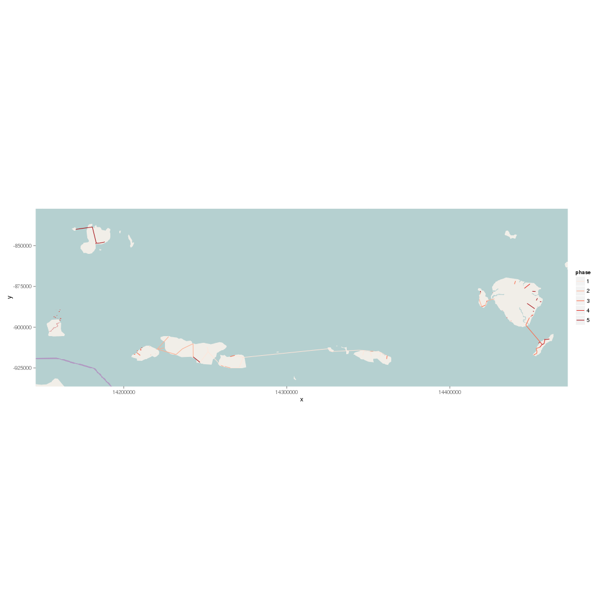

Example Usage of networkplanner R library
-----------------------------------------

Load networkplanner scenario from a directory and plot it.
"Fake" nodes, which represent connections to an existing network are blue.


```r
# assumes networkplanner.R library is installed
# and that you're working from the networkplanner.R src dir
require(networkplanner)
base_dir <- "../inst/test_data/108"
np <- read_networkplan(base_dir)
```

```
## OGR data source with driver: ESRI Shapefile 
## Source: "/home/cjn/src/networkplanner.R/inst/test_data/108", layer: "networks-proposed"
## with 115 features and 1 fields
## Feature type: wkbLineString with 2 dimensions
```

```r
V(np@network)[V(np@network)$Network..Is.fake]$color <- "blue"
plot(np@network, vertex.size=6, vertex.label="")
```

 

The above plot displays all nodes of the scenario, including those that are not
connected to the network.  The following chunk finds the subgraph of vertices
that are connected to the existing network.  


```r
# get the igraph from the NetworkPlan
g <- np@network

# get the fake vertex ids and those reachable from the fake vertex ids
fake_vids <- as.numeric(V(g)[V(g)$Network..Is.fake])
reachable <- unlist(sapply(fake_vids, 
  function(x) { 
    subcomponent(g, x, mode="ALL") 
  }))

# get the subgraph consisting of the reachable vertices
sg <- induced.subgraph(g, reachable)

V(sg)[V(sg)$Network..Is.fake]$color <- "blue"
plot(sg, vertex.size=6, vertex.label="")
```

 

Sequence the networkplan via the mv_v_dmd_sequence_model.
This model orders the vertices and edges via a combination of "network" order
and Downstream network length / Downstream demand (ascending, to connect
communities with most demand at least cost first)


```r
library(ggplot2)
np <- sequence_plan_far(np, sequence_model=mv_v_dmd_sequence_model)

settlements <- get.data.frame(np@network, what="vertices")

ggplot(settlements, aes(Sequence..Far.sighted.sequence, 
  Sequence..Downstream.distance.sum.m.per.downstream.demand.sum.kwh)) +
  geom_line() + 
  ylim(0, 0.2)
```

```
## Warning: Removed 101 rows containing missing values (geom_path).
```

 

Now let's plot the map via ggplot

```r
library(OpenStreetMap)

# get the vertices and edges as spatial dataframes
network_sdfs <- as_spatial_dataframes(np) 
v_spdf <- network_sdfs$vertices
e_sldf <- network_sdfs$edges

# get the bounds for base_map retrieval
bounds <- bbox(e_sldf)
# make 'em a little bigger for context
bounds[,1] <- bounds[,1] - 0.1
bounds[,2] <- bounds[,2] + 0.1

# get base_map via osm and plot
lower_left <- c(lat=bounds[2,2], lon=bounds[1,1])
upper_right <- c(lat=bounds[2,1],lon=bounds[1,2])
osm_map <- openmap(lower_left, upper_right, type="osm")

# change projection, fortify and merge back dataframe to get sequence values
proj <- CRS("+proj=merc +a=6378137 +b=6378137 +lat_ts=0.0 +lon_0=0.0 +x_0=0.0 +y_0=0 +k=1.0 +units=m +nadgrids=@null +no_defs")
e_sldf_wgs84 <- spTransform(e_sldf, proj)
e_sldf_wgs84.f <- fortify(e_sldf_wgs84, id=ID)
e_sldf_wgs84.f <- merge(e_sldf_wgs84.f, e_sldf_wgs84@data, by.x="id", by.y="ID")

# assign phases with 5 equal-density intervals
e_sldf_wgs84.f$phase <- cut(e_sldf_wgs84.f$Sequence..Far.sighted.sequence, breaks=5, labels=FALSE)


base_map <- autoplot(osm_map)
base_map + 
  geom_path(data=e_sldf_wgs84.f, aes(x=long,y=lat,group=group,color=factor(phase))) + 
  coord_equal() + 
  scale_color_brewer(name="phase", palette="Reds")
```

 
